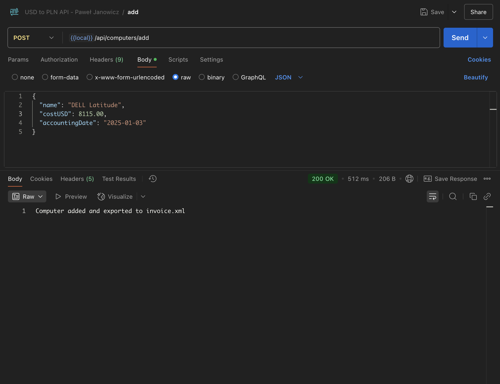
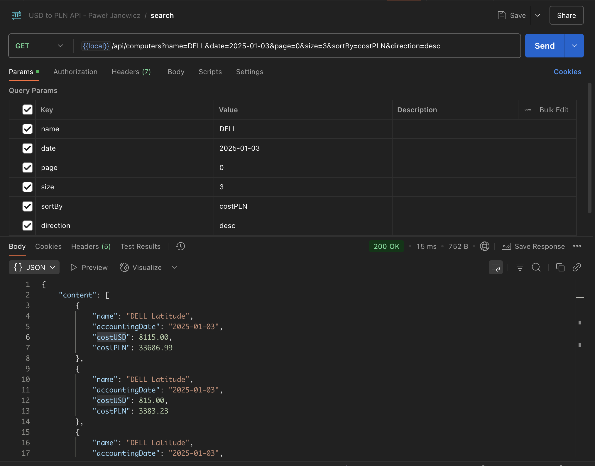
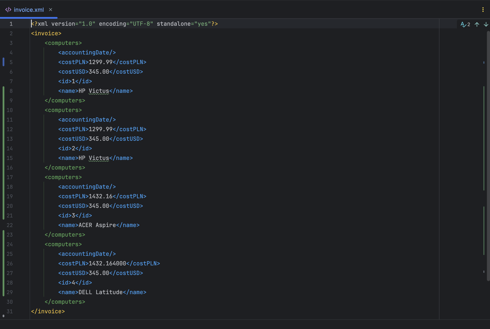

## :bookmark_tabs: About This Project

This Java application converts computer purchase prices from USD to PLN using the NBP public REST API based on the specified accounting date. It then stores the results in a relational database and exports them to an XML file in the desired format.

## 🚀 Getting Started

These instructions will help you set up the project locally for development and testing.

### 🔧 Prerequisites
- Java 17 or Java 21
- IDE (e.g. IntelliJ IDEA)
- Docker
- Maven 3.6+
- Postman


## ⚙️ Step-by-Step Setup

### 1. 🐳 Start the MySQL Database with Docker Compose
From the root of the project, run:

```bash
docker-compose up -d
```

This will start a MySQL container defined in `docker-compose.yml`,on port `3309`.

### 2. 📦 Build and Run the Spring Boot App
Make sure you're in the project root, then run:

```bash
./mvnw spring-boot:run
```

The application will start on `http://localhost:8888`.

Alternatively, you can build a JAR and run:
```bash
./mvnw package
java -jar target/usd-to-pln-invoice-app-0.0.1-SNAPSHOT.jar
```


### 3. 🧪 Test the API with Postman
A ready-to-use Postman collection is provided in the project: **`resources/postman/USD to PLN API - Paweł Janowicz.postman_collection.json`**.

#### 👉 How to use it:
- Open Postman
- Click **Import** → choose the file named `USD to PLN API - Paweł Janowicz.postman_collection.json`
- Use the available requests from the imported collection to interact with the API


## 📄 Output
- The computers are stored in the MySQL database.
- An XML file named `invoice.xml` is created in the root folder.


## 🔍 Useful Endpoints
| Method | Endpoint                 | Description                                                  |
|--------|--------------------------|--------------------------------------------------------------|
| POST   | `/computers/add`         | Add a new computer (JSON body)                               |
| GET    | `/api/computers`         | Search and sort computers by name or date (with pagination)  |

### 🔧 Query Parameters for `/api/computers`
| Param       | Type     | Required | Description                              |
|-------------|----------|----------|------------------------------------------|
| `name`      | String   | No       | Filter by computer name                  |
| `date`      | ISO Date | No       | Filter by date (e.g. 2025-05-11)         |
| `page`      | Integer  | No       | Page number (default: 0)                 |
| `size`      | Integer  | No       | Page size (default: 10)                  |
| `sortBy`    | String   | No       | Sort field (`name`, `date`, etc.)        |
| `direction` | String   | No       | Sort direction (`asc` or `desc`)         |

## :hammer_and_wrench: Used Technologies

* Java 17
* Spring Boot 3.4
* Spring Data JPA / Hibernate
* RestClient
* MySQL
* Lombok
* Maven

## :camera: Screenshots

Add computer and convert     |  Searching computers
:------------------------:|:-------------------------:
  |  

invoice (xml file)      
:------------------------:


## 🧑‍💻 Author
Project prepared by **Paweł Janowicz**. Contributions welcome.
